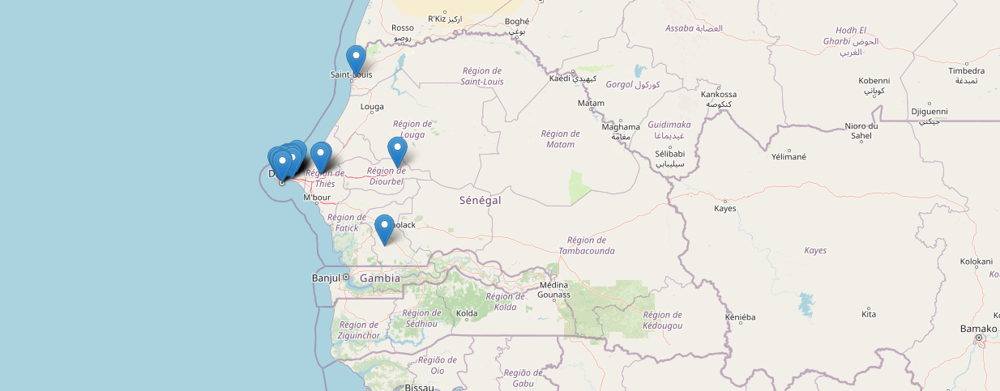

# Galsen DEV Map 🗺️

Où sont les devs aux Sénégal ?



## À propos

**Galsen DEV Map** est un projet open source qui vise à cartographier et connecter la communauté tech sénégalaise.

### Pourquoi ce projet ?

- **Visibilité** : Rendre visible la richesse de notre écosystème tech
- **Connexion** : Faciliter les rencontres et collaborations entre devs
- **Représentation** : Montrer que la tech au Sénégal ne se limite pas à Dakar
- **Inspiration** : Inspirer la prochaine génération de développeurs

## Fonctionnalités

- Carte interactive avec Leaflet
- Filtres par ville et par stack technique
- Profils des contributeurs avec liens GitHub
- Mode clair/sombre
- Interface responsive
- Performance optimale avec Next.js

## Stack Technique

- **Framework** : Next.js 14 + TypeScript
- **Styling** : TailwindCSS
- **Carte** : React Leaflet
- **Déploiement** : Netlify

## Installation & Lancement

### Prérequis

- Node.js 18+
- npm ou yarn

### Installation

```bash
# Clone le repo
git clone https://github.com/GalsenDev221/map.git
cd map

# Installe les dépendances
npm install

# Lance le serveur de dev
npm run dev
```

Ouvre [http://localhost:3000](http://localhost:3000) dans ton navigateur.

## Comment Contribuer

On accueille TOUTES les contributions avec plaisir !

1. Fork ce repo
2. Ouvre le dossier `data` et va dans le dossier `contributors`
3. Crée un nouveau fichier JSON avec ton username GitHub
4. Ajoute tes informations le nouveau fichier en suivant ce format :

```json
{
  "name": "Ton Nom",
  "city": "Ta Ville",
  "stack": ["Techno 1", "Techno 2", "etc"],
  "github": "https://github.com/username",
  "lat": 14.xxxx,
  "lng": -17.xxxx
}
```

> 💡 **Astuce** : Utilise [gps-coordinates.net](https://www.gps-coordinates.net) pour trouver les coordonnées de ta ville

🔒 Important : Pour ta sécurité, utilise UNIQUEMENT les coordonnées du centre de ta ville ou d'un point de repère public (monument, place, etc.). Ne mets JAMAIS ton adresse personnelle ou celle de ton lieu de travail.

⚠️ Ne pas utiliser les coordonnées (lat & lng) d'un autre contributeur.

4. Crée une Pull Request avec le titre : `feat: add [Ton Nom] from [Ta Ville]`

Lis notre [Guide de Contribution](CONTRIBUTING.md) pour plus de détails.

Un grand merci à tous ceux qui contribuent à ce projet ❤️

<a href="https://www.star-history.com/#GalsenDev221/map&type=date&legend=top-left">
 <picture>
   <source media="(prefers-color-scheme: dark)" srcset="https://api.star-history.com/svg?repos=GalsenDev221/map&type=date&theme=dark&legend=top-left" />
   <source media="(prefers-color-scheme: light)" srcset="https://api.star-history.com/svg?repos=GalsenDev221/map&type=date&legend=top-left" />
   
 </picture>
</a>

## License

Ce projet est sous licence [MIT](LICENSE).
